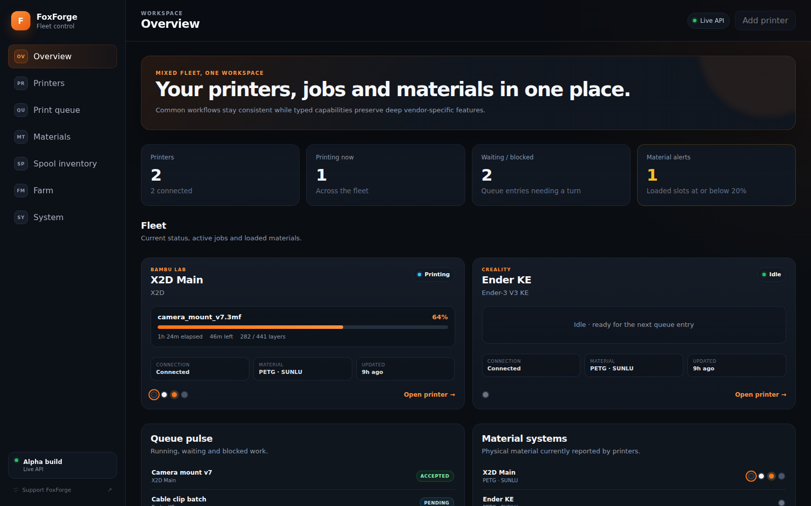
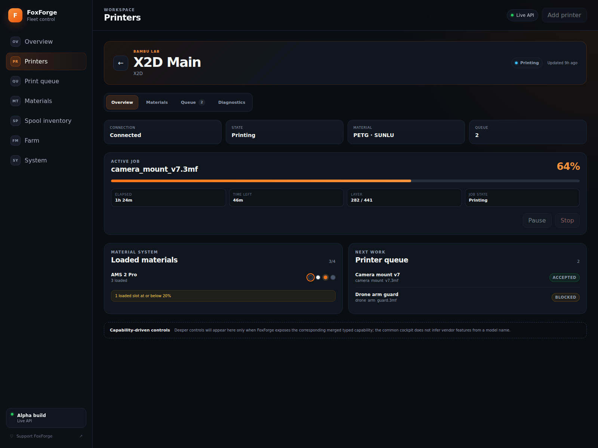
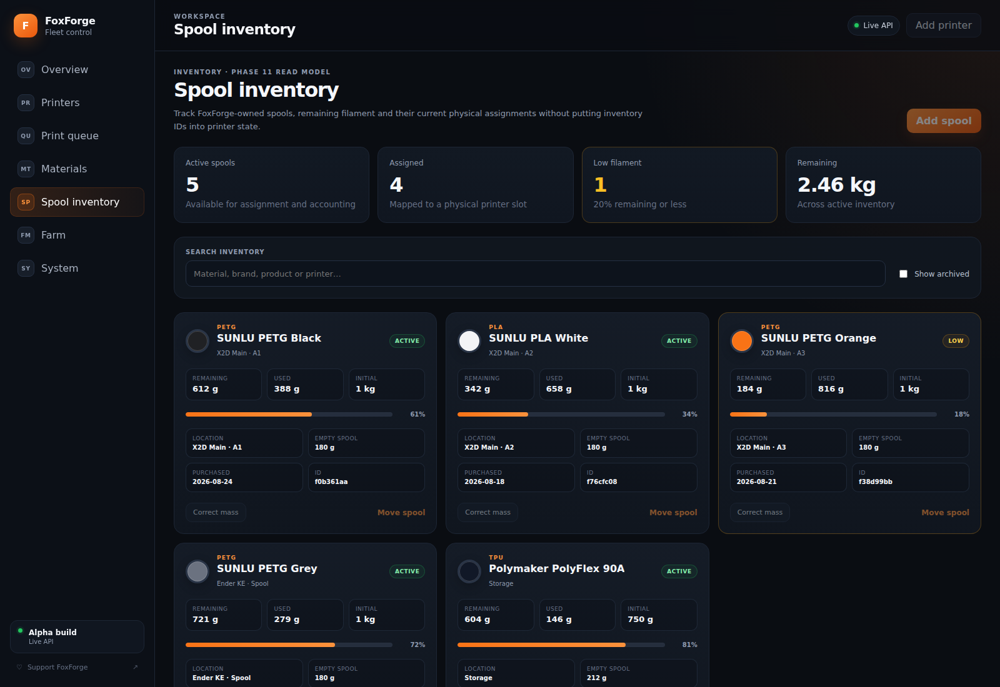
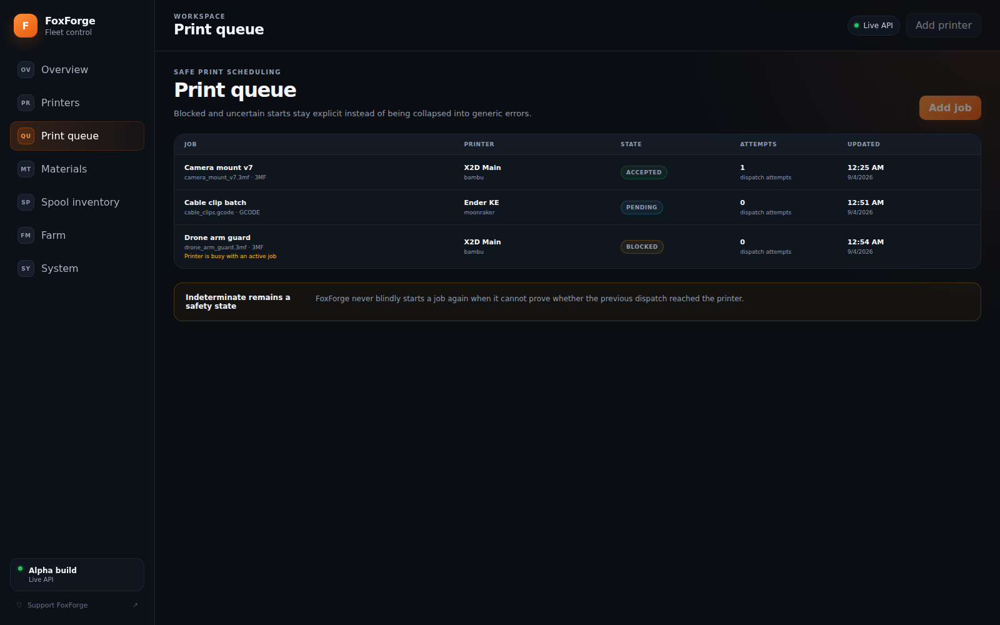
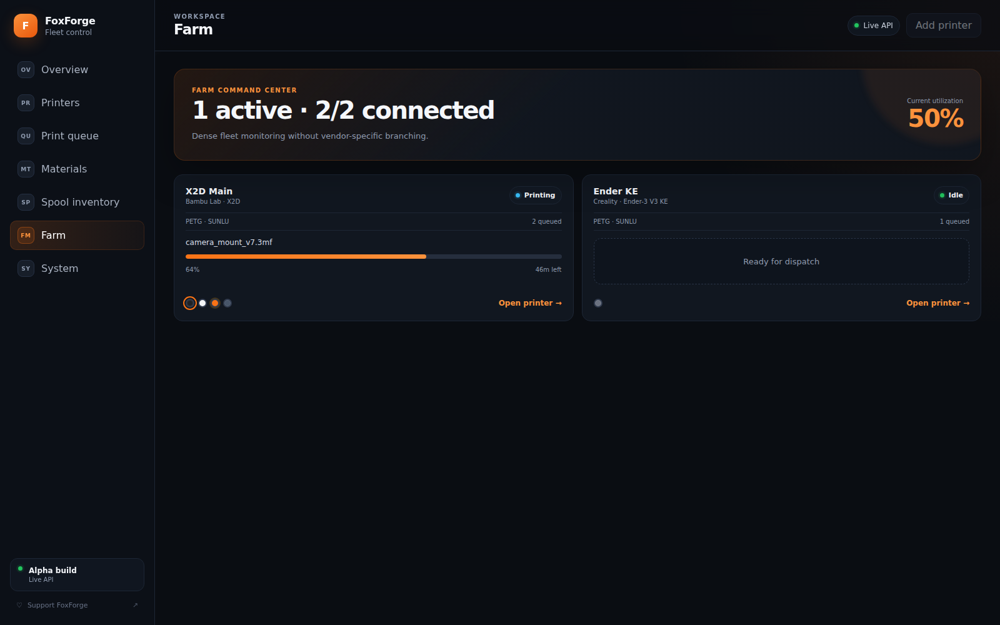

# FoxForge

**FoxForge is an open-source, self-hosted platform for managing mixed fleets of 3D printers without sacrificing deep vendor-specific functionality.**

FoxForge is building a common printer-management core for Bambu Lab, Moonraker/Klipper, print queues, material systems, filament inventory and farm-management workflows. Common behavior is exposed through vendor-neutral contracts, while advanced platform features remain available through typed vendor capabilities instead of being reduced to a lowest-common-denominator API.

> **Development status:** `v0.1.0-alpha.2` — second public runnable alpha pre-release. FoxForge ships a unified backend + web UI runtime with a versioned read API, SQLite persistence, Docker packaging, a Linux `amd64`/`arm64` GHCR image and a tested Umbrel Community App package. It is **not production-ready yet**: authenticated printer command APIs, realtime delivery, physical Bambu/Moonraker validation, automatic filament accounting and farm scheduling remain active work.

## Current alpha capabilities

The current `main` branch includes:

- a FoxForge-owned `PrinterAdapter` architecture with typed capabilities;
- Bambu Lab and Moonraker/Klipper adapters behind the same common application boundary;
- `FleetService` and adapter registry composition;
- a durable SQLite-backed print queue with explicit `INDETERMINATE` handling and safe retry/backoff rules;
- a durable SQLite filament/spool inventory with exact `Decimal` mass accounting, immutable idempotent adjustments and opaque physical-slot assignments;
- a versioned read-only HTTP API at `/api/v1` for fleet, queue and inventory state;
- a React + TypeScript + Vite web interface connected to the live `/api/v1` read models in normal runtime mode;
- explicit demo data only when requested with `?demo=1`;
- English, Russian and Ukrainian interface localization (`en`, `ru`, `uk`) with translation parity tests;
- one `aiohttp` server process serving both the compiled SPA and the backend API;
- a multi-stage Docker image and standalone Compose configuration;
- persistent `/data/config.json` and `foxforge.sqlite3` state;
- non-root steady-state container execution;
- CI coverage for Python 3.12/3.13, frontend type/tests/build and container startup smoke tests;
- a guarded release workflow publishing the versioned `v0.1.0-alpha.2` image for Linux `amd64` and `arm64`;
- an Umbrel Community App package (`my3d-foxforge`) pinned to the immutable `v0.1.0-alpha.2` image, with authenticated App Proxy access and dedicated amd64/arm64 anonymous-pull runtime tests.

## Interface preview

These are **real browser screenshots of the current FoxForge React application**, captured directly from the repository build. They use FoxForge's explicit built-in `?demo=1` mode so representative Bambu X2D, Moonraker, AMS, queue and inventory state can be shown without requiring physical printers during documentation capture. They are not UI mockups and are not AI-generated images.

### Fleet overview



| X2D printer cockpit | Filament inventory |
| --- | --- |
|  |  |

| Print queue | Farm view |
| --- | --- |
|  |  |

Additional captures: [Printers view](docs/images/ui/printers.png) · [Mobile overview](docs/images/ui/overview-mobile.png)

## Project goals

FoxForge is intended to become a self-hosted 3D-printer management platform with:

- multi-vendor printer management behind a common `PrinterAdapter` boundary;
- deep Bambu Lab support rather than a simplified compatibility layer;
- Moonraker/Klipper support for compatible printers;
- AMS/CFS/external-spool material-system integration;
- filament and spool inventory with automated consumption tracking;
- durable print queues and multi-printer/farm workflows;
- server-side operation suitable for Docker, ARM64 and Umbrel;
- APIs and a user interface built above the same vendor-independent application layer.

Bambu-specific capabilities such as AMS-family operations, drying, HMS, K profiles, dual-nozzle control, Virtual Printer and future X2D-specific storage/transport can remain first-class Bambu capabilities without leaking Bambu concepts into Moonraker or other adapters.

## Repository layout

```text
FoxForge/
├── backend/       Python 3.12+ domain, adapters, services, API and runtime
├── frontend/      TypeScript/React/Vite web application
├── deployment/    Docker and Umbrel deployment contracts/documentation
├── docs/          ADRs, design specifications and project status
└── integrations/  isolated migration/provenance material
```

The layout is governed by [ADR 0002: Repository layout](docs/adr/0002-repository-layout.md). Backend, frontend and deployment remain independently testable ownership areas but ship as one FoxForge application.

## Architecture

FoxForge follows a ports-and-adapters design.

```text
              Web UI / API / automation
                       |
              application services
          /-------------+-------------\
   FleetService    QueueService   InventoryService
          \             |             /
        PrinterAdapter + typed capabilities
                       |
              +--------+---------+
              |                  |
         BambuAdapter      MoonrakerAdapter
              |                  |
       MQTT / project        HTTP / WebSocket
      storage strategies       transport
```

The governing rule is:

> **Normalize what is genuinely common; preserve what is genuinely vendor-specific.**

The common printer domain owns printer identity, normalized snapshots/events/errors and capability discovery. Inventory remains a separate vendor-independent bounded context. Vendor payloads and model-specific behavior stay behind their adapter boundaries. Runtime-only vendor imports are restricted to the composition root.

FoxForge uses upstream projects as specialized references rather than as a base framework:

- **Bambuddy** — primary reference for deep Bambu protocol, state and product behavior;
- **PrintBuddy** — primary reference for multi-vendor/provider isolation ideas;
- **PrintOps** — primary reference for farm, scheduling and production-operations ideas;
- **FoxForge** — owner of the common domain, typed capability model, event model, durable queue, spool inventory, API/frontend contracts and deployment behavior.

See [ADR 0001: PrinterAdapter architecture](docs/adr/0001-printer-adapter-architecture.md), [ADR 0003: Upstream architecture synthesis](docs/adr/0003-upstream-architecture-synthesis.md), [Printer contracts v1](docs/design/printer-contracts.md) and the [Upstream adoption map](docs/design/upstream-adoption-map.md).

## Runtime model

The first alpha runtime composes configured Bambu LAN and Moonraker printers from versioned local configuration. On first start it creates a safe empty `/data/config.json`. Printer connection failures do not bring down the web/API process; reconnect attempts continue in the background.

The same runtime owns queue and inventory persistence in the application SQLite database and serves:

- `/healthz` — process health;
- `/api/v1/fleet` — normalized fleet snapshots;
- `/api/v1/queue` — canonical queue lifecycle read model;
- `/api/v1/inventory/spools` — spool inventory read model;
- the compiled React SPA from the same server process.

The public API is intentionally read-only at this stage. No anonymous printer-control or inventory-mutation HTTP API has been introduced.

## Current implementation status

| Area | Current state |
| --- | --- |
| Common printer domain | Implemented with normalized identity, snapshots, events, errors and typed capabilities |
| Printer adapters | Bambu and Moonraker foundations implemented behind common contracts |
| Fleet management | `AdapterRegistry` and `FleetService` implemented |
| Print queue | Durable dispatch/lifecycle/retry foundation implemented with SQLite persistence |
| Filament inventory | Durable SQLite spool inventory with exact mass ledger and slot assignments implemented |
| Public API | Versioned read-only `/api/v1` implemented for fleet, queue and inventory |
| Web UI | Live read integration implemented; EN/RU/UK localized; write controls remain unavailable until command APIs exist |
| Bambu LAN transport | MQTT/TLS + implicit FTPS implementation; physical X2D/Bambu validation pending |
| Moonraker transport | HTTP/WebSocket implementation; physical OpenKE/Moonraker validation pending |
| Docker | Unified image + Compose implemented and startup-smoke-tested on CI |
| ARM64 | `v0.1.0-alpha.2` image published; anonymous arm64 runtime smoke passes under CI/QEMU; representative Raspberry Pi hardware validation remains pending |
| Umbrel | `my3d-foxforge` Community App implemented and merged; immutable alpha image, App Proxy, persistence and amd64/arm64 runtime gates validated |
| Farm scheduler | Single-pass queue runner exists; persistent farm policy/scheduler is not implemented yet |

## UmbrelOS installation

FoxForge `v0.1.0-alpha.2` is available in the companion Community App Store:

```text
https://github.com/MikeFox303/umbrel-3d-printing-store
```

After registering/refreshing that Community Store in UmbrelOS, install **FoxForge** from the normal Umbrel App Store UI. The package ID is `my3d-foxforge` and its dedicated Umbrel app port is `8283`.

The package:

- uses the exact immutable `v0.1.0-alpha.2` GHCR multi-architecture image;
- leaves standard Umbrel App Proxy authentication enabled;
- stores configuration, queue and inventory state under the Umbrel app data directory mounted as `/data`;
- uses bridge networking and explicit printer addresses, with no Docker socket or privileged mode;
- was tested through anonymous GHCR pulls and startup/health/UI/persistence smoke tests for `linux/amd64` and `linux/arm64`.

The alpha UI does not yet write printer configuration. First-start Bambu LAN and Moonraker examples are documented in [`deployment/umbrel/`](deployment/umbrel/README.md) and in the Store package README.

CI/QEMU arm64 validation proves the image is pullable and executable for the published architecture, but it does not replace representative Raspberry Pi 5 or real printer-network validation.

## What is not finished yet

FoxForge should not yet be presented as a production replacement for Bambuddy, Moonraker frontends or a complete printer-farm application.

Priority remaining work includes:

1. **Physical printer validation** for Bambu LAN/X2D and Moonraker/OpenKE: connect, live state, upload, print start, lifecycle and completion.
2. **Authenticated command APIs** for queue operations, printer commands and inventory mutations with validation, idempotency and normalized errors.
3. **Realtime delivery** through WebSocket/SSE into the frontend query cache.
4. **Automatic filament accounting** linked to print completion, material selection and trustworthy usage estimates.
5. **Farm scheduling** above `QueueRunner.run_once()`: printer selection, priority/deadline policy and durable multi-process lease/CAS semantics.
6. **Deep Bambu capabilities** including AMS operations/drying, HMS, K profiles, dual nozzle and Virtual Printer/X2D-specific behavior.
7. **Representative ARM64/Umbrel hardware validation and upgrade testing** on Raspberry Pi-class hosts using the existing Community App package.
8. Additional vendor adapters only after the common contracts are proven by real hardware use.

## Safety invariants

Several rules are deliberate and should remain true as the project grows:

- ambiguous print starts become `INDETERMINATE` and are never blindly retried;
- receipt-bearing jobs are never redispatched by retry logic;
- printer material snapshots expose physical state and opaque slot IDs, not FoxForge `spool_id` values;
- API DTOs and the frontend do not consume raw Bambu/Moonraker protocol payloads;
- runtime secrets stay in local configuration and are not exposed by public read DTOs;
- Docker and Umbrel package the same application behavior;
- Umbrel App Proxy authentication remains enabled until FoxForge has an explicit application authentication model;
- upstream-derived material must retain required copyright/license provenance and remain distinguishable from newly written FoxForge code.

## Bambu and upstream projects

FoxForge is its own project and is **not a Bambuddy, PrintBuddy or PrintOps distribution or permanent fork**.

Bambuddy, PrintBuddy and PrintOps are studied for different architectural purposes. The accepted strategy is recorded in [ADR 0003](docs/adr/0003-upstream-architecture-synthesis.md): use Bambuddy for Bambu depth, PrintBuddy for multi-vendor/provider ideas, PrintOps for operations/farm ideas, and keep FoxForge's own domain/capability/event/queue/inventory architecture as the integration skeleton.

The remaining [`integrations/bambuddy/`](integrations/bambuddy/) content is limited to migration/provenance and localization records. The retired X2D port-6000 experiment was removed instead of being carried forward as dormant implementation code. Any future X2D/eMMC transport will be implemented behind `BambuProjectStorage` after physical validation.

Production Umbrel packaging of official Bambuddy releases remains a separate concern in `MikeFox303/umbrel-3d-printing-store`.

## Release/version note

The Community App is pinned to the released `v0.1.0-alpha.2` image. FoxForge `main` may continue to receive UI/UX and runtime improvements after that release. Those changes are intentionally **not** delivered through a floating container tag; they require the next guarded FoxForge release and a corresponding immutable Store package update.

## Documentation

Durable architecture and implementation decisions live in [`docs/`](docs/README.md).

Key documents include:

- [Current project status](docs/project-status.md)
- [ADR 0001: PrinterAdapter architecture](docs/adr/0001-printer-adapter-architecture.md)
- [ADR 0002: Repository layout](docs/adr/0002-repository-layout.md)
- [ADR 0003: Upstream architecture synthesis](docs/adr/0003-upstream-architecture-synthesis.md)
- [Upstream adoption map](docs/design/upstream-adoption-map.md)
- [Printer contracts v1](docs/design/printer-contracts.md)
- [Bambu LAN production transport](docs/design/bambu-lan-transport.md)
- [Bambu project storage strategy](docs/design/bambu-project-storage.md)
- [Moonraker HTTP/WebSocket transport](docs/design/moonraker-http-transport.md)
- [Queue dispatch and durable idempotency](docs/design/queue-dispatch.md)
- [Queue event-driven lifecycle](docs/design/queue-event-lifecycle.md)
- [Queue retry policy](docs/design/queue-retry-policy.md)
- [Inventory foundation](docs/design/inventory-foundation.md)
- [SQLite inventory persistence](docs/design/inventory-sqlite.md)
- [Public API v1](docs/design/public-api-v1.md)
- [Web UI foundation](docs/design/web-ui-foundation.md)
- [Frontend parallel development policy](docs/design/frontend-parallel-development.md)
- [Umbrel deployment](deployment/umbrel/README.md)

Repository-level implementation guardrails are summarized in [`AGENTS.md`](AGENTS.md) so contributors and coding agents discover the same accepted rules from the repository rather than relying on chat memory.

See [`CHANGELOG.md`](CHANGELOG.md) for implementation and validation history.

## Development

Backend development targets **Python 3.12+**.

```bash
git clone https://github.com/MikeFox303/FoxForge.git
cd FoxForge/backend
python -m venv .venv

# Activate the environment, then:
pip install -e ".[dev]"
pytest
ruff check src tests
ruff format --check src tests
```

For the web UI:

```bash
cd ../frontend
npm install
npm run dev

npm run check
npm test
npm run build
```

For the standalone container/Compose runtime, see [`deployment/docker/`](deployment/docker/). For Umbrel packaging and validation details, see [`deployment/umbrel/`](deployment/umbrel/README.md).

Frontend and backend development may proceed in parallel, but merged `main` is the authoritative contract state. Implementation changes should respect the ADR/design boundaries and include acceptance criteria plus tests for new contracts and failure semantics.

## ❤️ Support FoxForge

FoxForge is free and open-source. If you find the project useful and would like to support continued development, test hardware and infrastructure, you can make a voluntary contribution on Ko-fi.

[☕ Support FoxForge on Ko-fi](https://ko-fi.com/mikefox303)

Support is completely optional and does not affect access to FoxForge or its source code.

## License

FoxForge is licensed under the **GNU Affero General Public License v3.0 only (`AGPL-3.0-only`)**.

See [`LICENSE`](LICENSE) for the full license text.